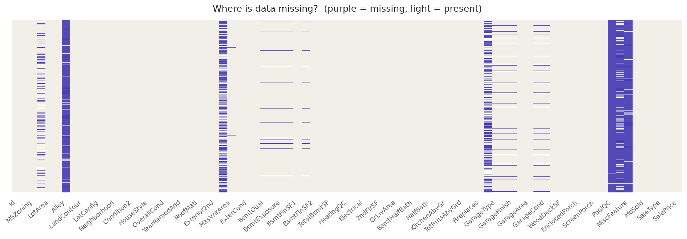
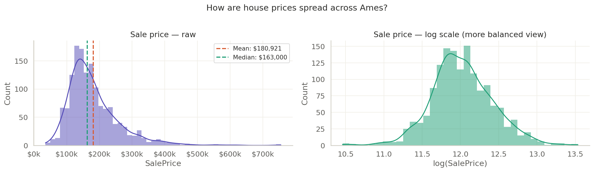
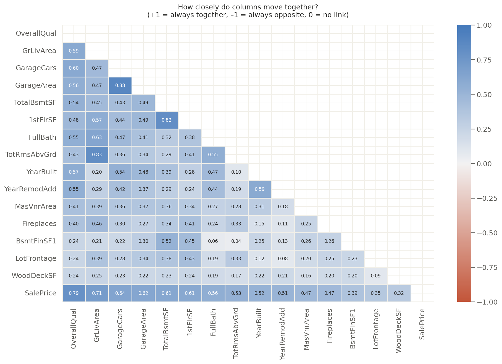
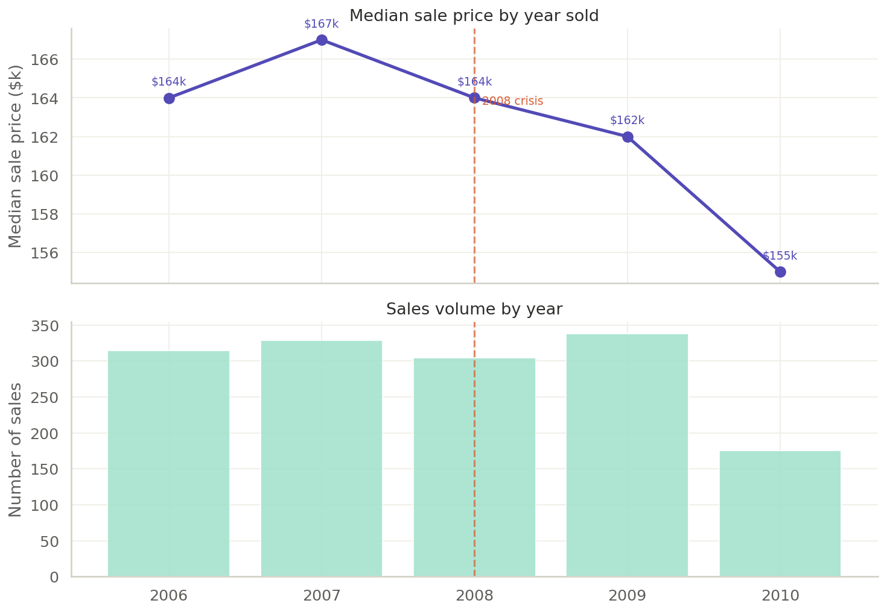
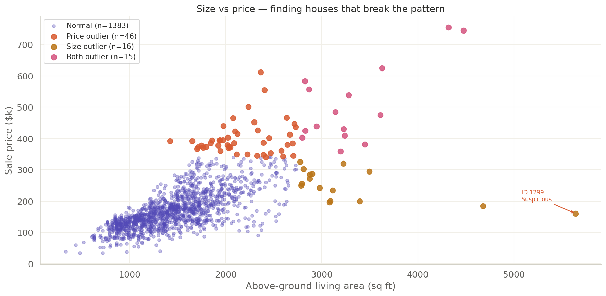
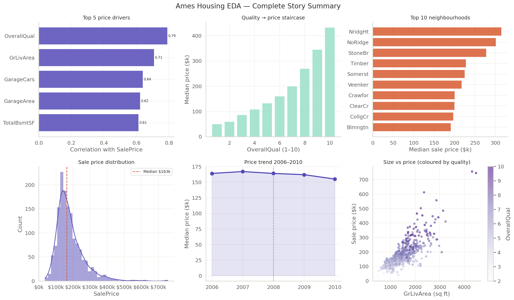

# StoryData EDA — Ames Housing Price Analysis

> *"What actually drives house prices in Ames, Iowa — beyond just location?"*

A narrative-first EDA project that guides any reader — technical or not — through 1,460 house sales using animated Plotly charts, Seaborn heatmaps, and distribution plots. Structured as a six-act story.

## Visual highlights

**Act 1 — Missing values at a glance**


**Act 2 — Distribution portraits**


**Act 3 — What actually correlates with price**


**Act 4 — Did 2008 leave a mark?**


**Act 5 — Which houses break the pattern**


**Act 6 — The punchline**


---

## What I found

- **Quality beats size** — `OverallQual` is the #1 predictor of `SalePrice` (r ≈ 0.79), stronger than living area
- **The neighbourhood premium** — identical houses in top vs bottom neighbourhoods differ by $150k+
- **Ames survived 2008** — sales volume dropped but prices barely flinched, thanks to Iowa State University's economic anchor
- **Two outliers are data errors** — large-area, low-price entries that must be removed before modelling
- **Log-transforming SalePrice** reveals a more honest picture of the market than the raw skewed distribution

---

## Dataset

| Field | Detail |
|---|---|
| Source | [Kaggle — House Prices: Advanced Regression Techniques](https://www.kaggle.com/competitions/house-prices-advanced-regression-techniques) |
| Rows | 1,460 |
| Columns | 81 (80 features + SalePrice) |
| Years covered | 2006–2010 |
| License | Competition dataset |

> Download `train.csv` from Kaggle and place it in `data/raw/` before running notebooks.

---

## Project structure

```
storydata-eda/
│
├── data/
│   ├── raw/                        ← train.csv from Kaggle (not tracked by git)
│   └── processed/                  ← cleaned.csv (auto-generated by Act 1)
│
├── notebooks/
│   ├── 01_act1_meet_the_data.ipynb         ← shape, missing values, data types
│   ├── 02_act2_distributions.ipynb         ← SalePrice, GrLivArea, OverallQual spreads
│   ├── 03_act3_relationships.ipynb         ← correlation heatmap, top drivers, neighbourhood
│   ├── 04_act4_time_trends.ipynb           ← 2006–2010 price trends, 2008 crash effect
│   ├── 05_act5_outliers.ipynb              ← IQR outlier detection, interactive scatter
│   └── 06_act6_punchline.ipynb            ← summary dashboard, final findings
│
├── outputs/
│   ├── figures/                    ← .png charts (Seaborn)
│   └── report/                     ← .html interactive charts (Plotly)
│
├── src/
│   └── utils.py                    ← shared plot config, helper functions, narrative tools
│
├── .gitignore
├── requirements.txt
├── FINDINGS.md                     ← plain-English insights (no data background needed)
├── GITHUB_SETUP.md                 ← step-by-step GitHub upload guide
└── README.md
```

---

## The six-act story

| Act | Title | Opening question | Key visual |
|---|---|---|---|
| 1 | Meet the data | How many features, what's missing? | Missing value heatmap |
| 2 | Distribution portraits | What does a typical Ames house look like? | Histogram + boxplots |
| 3 | Hidden relationships | Does quality really beat size? | Correlation heatmap + scatter |
| 4 | Change over time | Did 2008 leave a mark on Ames? | Animated price trend |
| 5 | The outlier plot | Which houses break every pattern? | Interactive scatter, IQR flags |
| 6 | The punchline | So what actually drives prices? | Summary dashboard |

---

## Tech stack


---

## How to run

```bash
git clone https://github.com/YOUR_USERNAME/storydata-eda.git
cd storydata-eda
python -m venv venv && source venv/bin/activate
pip install -r requirements.txt
# Place train.csv in data/raw/
jupyter notebook
# Run notebooks 01 through 06 in order
```

---

## Interactive charts

Plotly charts are saved to `outputs/figures/` as `.html` — open in any browser, no Python needed.

---

## Author

**Venkatraman R** · [LinkedIn](https://linkedin.com/in/venkatraman0400) · [GitHub](https://github.com/venkatraman0400-blip)
